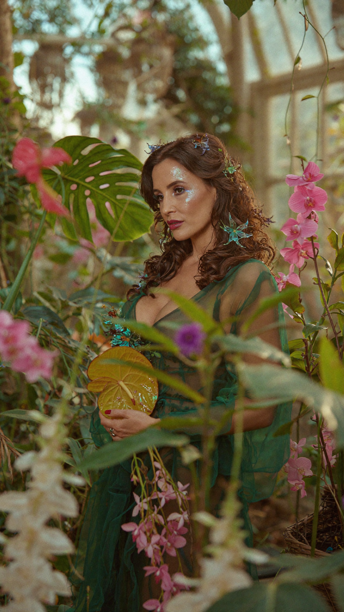
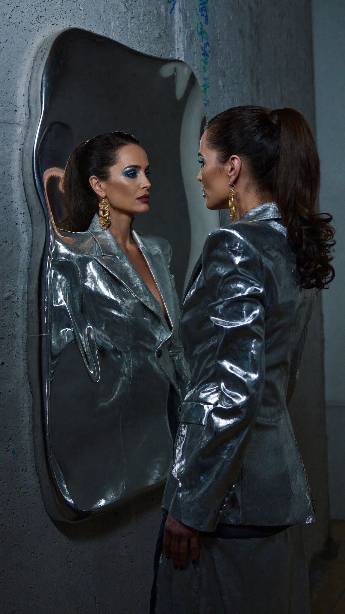
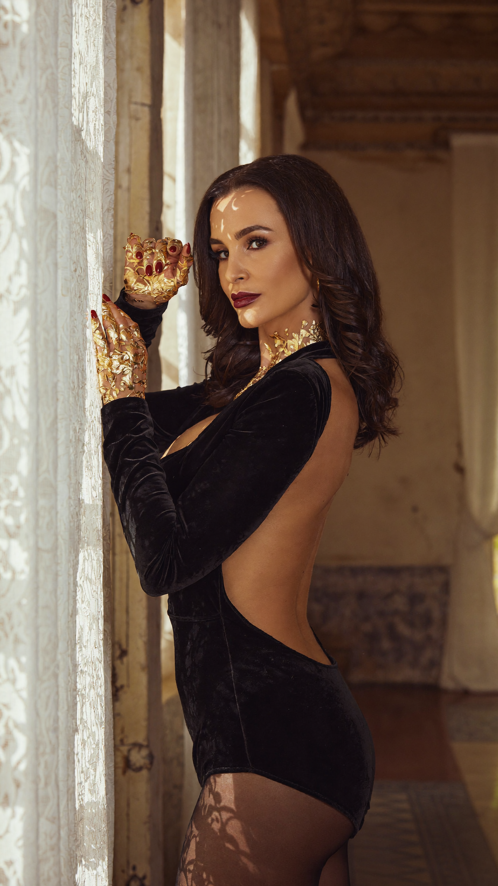

# 🎬 Cinematic AI Workflows & Prompt Architecture

**By Isaac Crutchley** | Creative Video Lead @ OhChat  
*Bridging high-end commercial post-production with generative AI systems.*

This repository documents my methodologies for pushing generative AI video and image models toward true editorial realism. It focuses on mitigating common generative failure modes, simulating real-world physics, and treating AI as a highly directable cinematic tool.

---

## 🧭 Core Philosophy: The Systems Approach

I do not treat AI as a slot machine; I build repeatable, technical frameworks to achieve bespoke creative outputs. My prompts are engineered to bridge traditional cinematography with generative generation, focusing on:

1.  **Physical Accuracy:** Simulating real-world lens characteristics, light dispersion, and material textures.
2.  **Analog Aesthetics:** Replicating specific film stocks (e.g., Kodak Portra, Tri-X) and camera bodies (e.g., Arriflex 435, Hasselblad).
3.  **Unified Audio-Visuals:** Designing visual prompts with specific vocal tones, environmental reverb, and narrative pacing in mind.

---

## ⚙️ Prompt Design Framework

Every prompt in this system follows a strict 6-part architecture to ensure consistency and mitigate AI hallucinations:

1.  **Subject & Intent:** The core narrative focus.
2.  **Styling:** Granular details on wardrobing, makeup, and material textures.
3.  **Environment:** The physical space and its inherent atmospheric qualities.
4.  **Lighting:** Specific directionality, color temperature, and physical light behavior.
5.  **Technical Specs:** Camera body, film stock, lens focal length, and depth of field.
6.  **Failure Mode Targeting:** Explicit instructions designed to prevent common model errors (e.g., "flat depth," "plastic skin").

---

## 🔬 Case Study: Experimental Refraction

**Objective:** Test a model's ability to handle complex light dispersion and layered transparency without defaulting to artificial "rainbow overlays."

**Common Generative Failures Addressed:**
* `Error:` Fake, digitally applied rainbow overlays.
* `Error:` Incorrect light direction and shadow mapping.
* `Error:` Flat spatial depth when rendering transparent objects.

**The Engineered Solution:**

> **Prompt Architecture (01. Experimental Refraction Portrait):**
> 
> A vertical cinematic film shot, a highly experimental, multi-layered portrait of a brunette woman fragmented by light refracting through glass.
> 
> **Styling:** She wears a custom-made jacket covered entirely in iridescent sequins that shift from blue to purple to green. Her dark brunette hair is styled in a futuristic, angular cut. Her makeup is minimalist but features an unexpected pop of electric cyan eyeliner on the lower waterline. She holds an array of large, cut crystal prisms in front of her face.
> 
> **Setting:** A contemporary, abstract art installation space with minimalist white walls and subtle pops of neon light (soft focus).
> 
> **Lighting:** Strong, direct light (from a projector or spotlight) hits the prisms, splitting the light into vibrant rainbow spectra and abstract shapes that overlay her face and jacket, creating a dynamic, “living” pattern of color.
> 
> **Technical Specs:** Arriflex 435 (35mm film). Kodak Portra 160 (fine grain, rich color rendering). 21mm ultra-wide lens to emphasize spatial distortion and geometry. Deep depth of field to capture layered textures across sequins, prisms, and projected light. 9:16 aspect ratio.

---

## 🗂️ Prompt Collection Library

### 01. Experimental Refraction Portrait
**Focus:** Complex light dispersion and layered transparency.

> **Prompt:**
> A vertical cinematic film shot, a highly experimental, multi-layered portrait of a brunette woman fragmented by light refracting through glass.
> 
> **Styling:** She wears a custom-made jacket covered entirely in iridescent sequins that shift from blue to purple to green. Her dark brunette hair is styled in a futuristic, angular cut. Her makeup is minimalist but features an unexpected pop of electric cyan eyeliner on the lower waterline. She holds an array of large, cut crystal prisms in front of her face.
> 
> **Setting:** A contemporary, abstract art installation space with minimalist white walls and subtle pops of neon light (soft focus).
> 
> **Lighting:** Strong, direct light (from a projector or spotlight) hits the prisms, splitting the light into vibrant rainbow spectra and abstract shapes that overlay her face and jacket, creating a dynamic, “living” pattern of color.
> 
> **Technical Specs:** Arriflex 435 (35mm film). Kodak Portra 160 (fine grain, rich color rendering). 21mm ultra-wide lens to emphasize spatial distortion and geometry. Deep depth of field to capture layered textures across sequins, prisms, and projected light. 9:16 aspect ratio.

---

### 02. Optical Illusion Portrait
**Focus:** High-contrast graphic rendering and medium-format emulation.

> **Prompt:**
> A vertical cinematic film shot, a highly stylized, graphic portrait of a brunette woman looking directly into the lens with a piercing expression.
> 
> **Styling:** She wears a high-fashion, avant-garde gown featuring an intense black and white chevron optical illusion pattern. Her makeup is graphic and minimal: extremely pale skin, sharp black winged eyeliner, and dark cherry lipstick. Her dark brunette hair is molded into a glossy, architectural, sculptural bob. She wears massive, flat disc earrings that reflect the graphic patterns of the dress.
> 
> **Setting:** An ultra-minimalist studio setting with a clean, light-grey background. The focus is entirely on the clashing textures and lines.
> 
> **Lighting:** Strong, directional lighting (clamshell style) that emphasizes the texture of the makeup and the geometry of the hair. The shadows are deep but controlled.
> 
> **Technical Specs:** Hasselblad 500CM (Medium format film). Kodak Tri-X 400. 80mm lens. Shallow depth of field. 9:16 aspect ratio.

---

### 03. Botanical Fusion Portrait
**Focus:** Organic shadow casting and complex foliage rendering.

> **Prompt:**
> A vertical cinematic film shot, a whimsical, multi-layered portrait of a brunette woman partially obscured by lush, exotic flora.
> 
> **Styling:** She wears a sheer, ethereal gown in deep forest green organza. She is surrounded by oversized botanicals: monstera leaves, pink anthuriums, orchids. Hair in loose waves with interwoven wildflowers. Dewy, iridescent makeup. Dreamy expression.
> 
> **Setting:** A grand conservatory or dense botanical studio environment.
> 
> **Lighting:** Soft golden-hour light filtering through glass and foliage, casting organic shadows.
> 
> **Technical Specs:** Arriflex 435. Kodak Portra 400H. 50mm lens. Very shallow depth of field. 9:16.

---

### 04. Sculptural Reflection Portrait
**Focus:** Metallic surface reflection and cold gallery lighting physics.

> **Prompt:**
> A vertical cinematic film shot, a conceptual profile portrait of a brunette woman facing a warped polished metal mirror.
> 
> **Styling:** Metallic silver sculptural blazer, slicked-back hair, geometric blue eyeshadow, molten gold earrings.
> 
> **Setting:** Minimalist gallery with concrete textures. Mirror is an abstract reflective sculpture.
> 
> **Lighting:** Cold, high-contrast gallery lighting.
> 
> **Technical Specs:** Arriflex 435. Kodak Portra 400 VC. 35mm lens. Shallow depth of field. 9:16.

---

### 05. Gilded Shadow Portrait
**Focus:** Intricate shadow mapping and low-light skin luminance.

> **Prompt:**
> A vertical cinematic portrait where light and shadow define the composition.
> 
> **Styling:** Black velvet bodysuit, luminous skin, burgundy lips, gold-leaf hands framing the face.
> 
> **Setting:** Old-world European apartment with ornate window and lace curtain.
> 
> **Lighting:** Golden hour sunlight filtered through lace, casting intricate shadow patterns.
> 
> **Technical Specs:** Arriflex 435. Kodak Portra 400H. 50mm lens. Very shallow depth of field. 9:16.

---

## 🔊 Audio-Visual Pipeline Integration

Visuals are only half the system. I actively build integrated AI audio pipelines to ensure the final output feels cohesive and emotionally timed.

**The Workflow:**
1.  **Music Bed (Suno):** Generate structural pacing, tone, and mood.
2.  **Voice Synthesis (ElevenLabs):** Design specific character tones (e.g., whispered, cinematic) and environmental soundscapes (reverb, space).
3.  **Unified Sequencing:** Edit and sequence the generated audio to drive the emotional beats of the cinematic visual prompts.

---

### 📬 Connect

I am currently exploring opportunities to build scalable AI-native storytelling systems for high-end commercial applications. 

* [Portfolio & Showreel](https://www.isaacwcrutchley.com)
* [LinkedIn]([https://www.linkedin.com/in/isaaccrutchley](https://www.linkedin.com/in/isaac-crutchley-812501158/))
